<a id="topo"></a>

<p align="center">
  
</p>

<p align="center">
  <a href="#recursos"><b>Recursos</b></a> ·
  <a href="#prints"><b>Prints</b></a> ·
  <a href="#instalacao"><b>Instalação</b></a> ·
  <a href="#atalhos"><b>Atalhos</b></a> ·
  <a href="#desenvolvimento"><b>Desenvolvimento</b></a> ·
  <a href="#arquitetura"><b>Arquitetura</b></a> ·
  <a href="#testes"><b>Testes</b></a> ·
  <a href="#publicacao"><b>Publicação</b></a> ·
  <a href="#documentacao"><b>Documentação</b></a>
</p>

<p align="center">
  
  
  
  
</p>

<p align="center">
  
</p>

O **Agzos Browser** é um navegador desktop em Electron com a identidade da Agzos (preto
`#0E0E0E`, vermelho `#D10A11`, branco `#FFFDFD`). Ele junta navegação de verdade e adblock
real com IA, um cofre de senhas e ferramentas para quem desenvolve. Tudo isso fica numa
casca única, com tema escuro ou claro e efeito de vidro.


<a id="recursos"></a>

## ✦ Recursos

<table>
  <tr>
    <td width="50%" valign="top">
      <h3>🧭 Navegação</h3>
      <ul>
        <li>Guias com grupos, workspaces, tela dividida e guias verticais</li>
        <li>Hibernação de guias, seletor do Ctrl+Tab com miniaturas e prévia com RAM/CPU</li>
        <li>Várias janelas com sessão restaurada depois de travar</li>
        <li><b>Session Tabs</b>: logins separados do mesmo site lado a lado</li>
        <li>Painéis laterais (WhatsApp, Telegram, Claude, Spotify…) que expandem para a tela toda</li>
        <li>Barra lateral redimensionável: só ícones, ícone e nome, ou larga</li>
      </ul>
    </td>
    <td width="50%" valign="top">
      <h3>🛡️ Privacidade</h3>
      <ul>
        <li>Adblock real com as listas do uBlock Origin, incluindo scriptlets e regras cosméticas</li>
        <li>Permissões por site, guia anônima e zoom por site</li>
        <li><b>Agzos Key</b>: cofre de senhas e códigos MFA (TOTP) com preenchimento automático</li>
        <li>Identidade de Chrome para o login do Google funcionar nas guias</li>
      </ul>
    </td>
  </tr>
  <tr>
    <td width="50%" valign="top">
      <h3>🤖 Agzos AI</h3>
      <ul>
        <li>Chat no estilo do Claude, com Groq, conversas em guias, projetos e personalização</li>
        <li>Respostas em markdown que chegam aos pedaços, com artifacts (HTML, SVG e código) abertos ao lado</li>
        <li>Chave guardada só no cofre do sistema (<code>safeStorage</code>)</li>
      </ul>
    </td>
    <td width="50%" valign="top">
      <h3>🛠️ Para quem desenvolve</h3>
      <ul>
        <li><b>Portas em uso</b>: processo, PID e projeto, com matar processo e túnel HTTPS (cloudflared)</li>
        <li><b>API Scratchpad</b>: captura e reenvia requisições da guia</li>
        <li><b>Mira de elemento</b> (Ctrl+Shift+C): cores HEX, fonte e classes Tailwind</li>
        <li>Terminal integrado (embaixo, à direita ou flutuante), com SSH, voz e CLIs de IA</li>
      </ul>
    </td>
  </tr>
  <tr>
    <td width="50%" valign="top">
      <h3>🧩 Extensões</h3>
      <ul>
        <li>Manifest V3 e V2, descompactadas ou instaladas pelo link da Chrome Web Store, com aviso de atualização</li>
        <li>Pop-up no estilo Chrome/Edge: fixar na barra, pop-up da extensão ancorado no ícone e acesso por site</li>
        <li>Widevine (Electron da castLabs) para conteúdo protegido, só reprodução</li>
      </ul>
    </td>
    <td width="50%" valign="top">
      <h3>📖 Leitura e captura</h3>
      <ul>
        <li>Modo leitura com um ícone de caderno na barra de URL, que só aparece quando a página tem artigo</li>
        <li>Notas por página em markdown, captura de tela (guia, região ou janela) e salvar imagem já carregada</li>
        <li>Instalar sites como app (PWA) e abrir qualquer arquivo numa guia</li>
      </ul>
    </td>
  </tr>
</table>

<p align="right"><a href="#topo">↑ topo</a></p>


<a id="prints"></a>

## ✦ Prints

|                                   Ferramentas na barra lateral                                   |                                        Pop-up de extensões                                         |
| :----------------------------------------------------------------------------------------------: | :------------------------------------------------------------------------------------------------: |
| 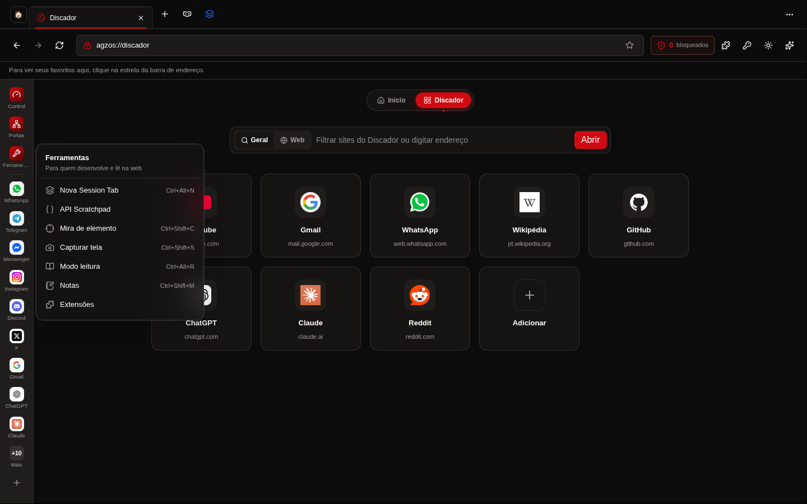 |    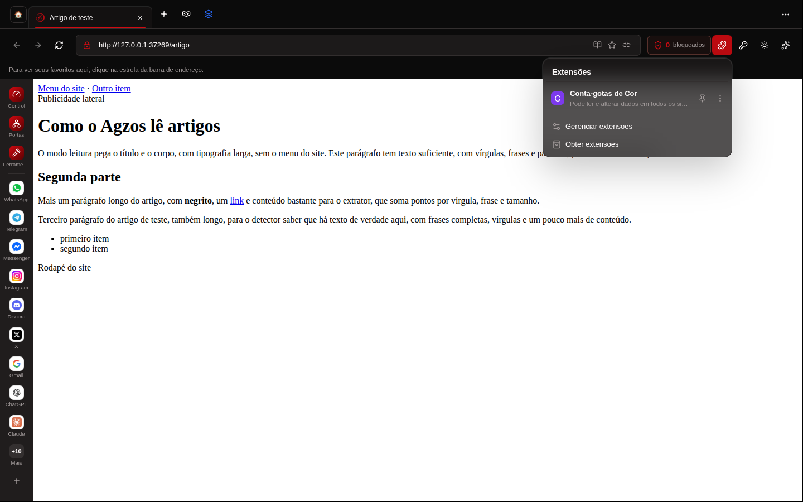     |
|                                 **Pop-up da extensão ancorado**                                  |                                        **Menu da extensão**                                        |
| 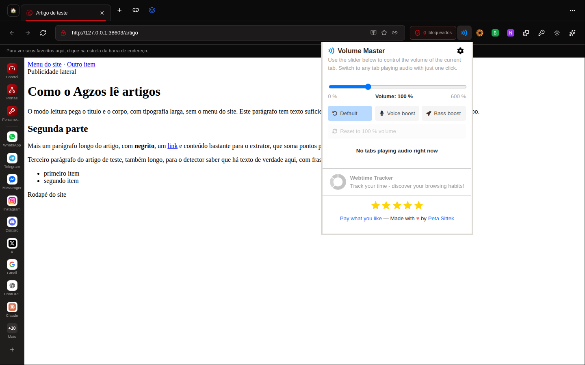  | 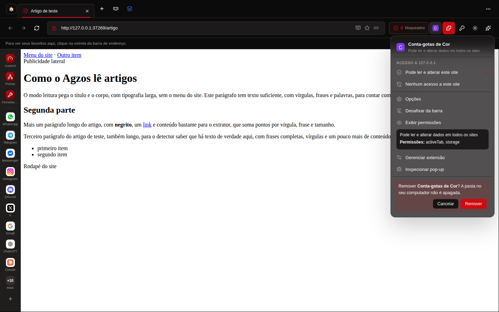 |
|                                     **Portas e túnel HTTPS**                                     |                                        **Mira de elemento**                                        |
|      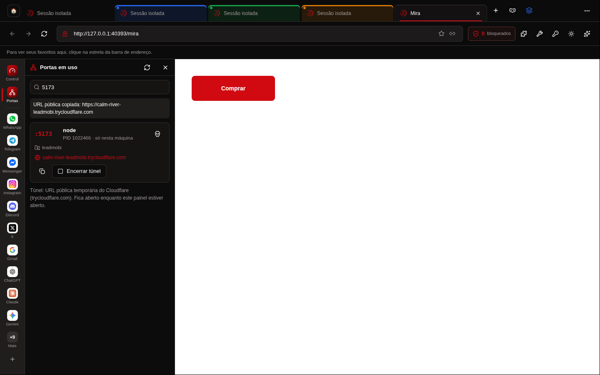       |     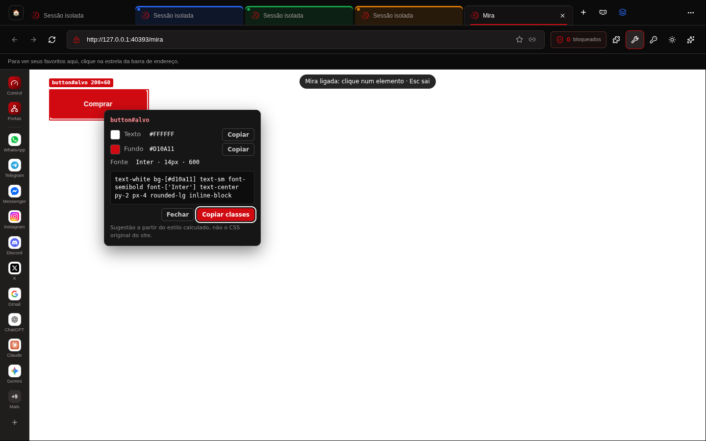      |
|                                        **API Scratchpad**                                        |                                          **Modo leitura**                                          |
|      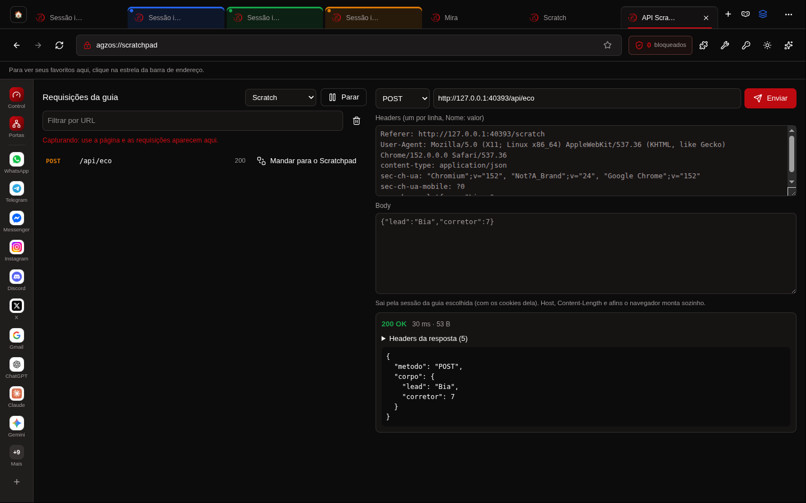       |      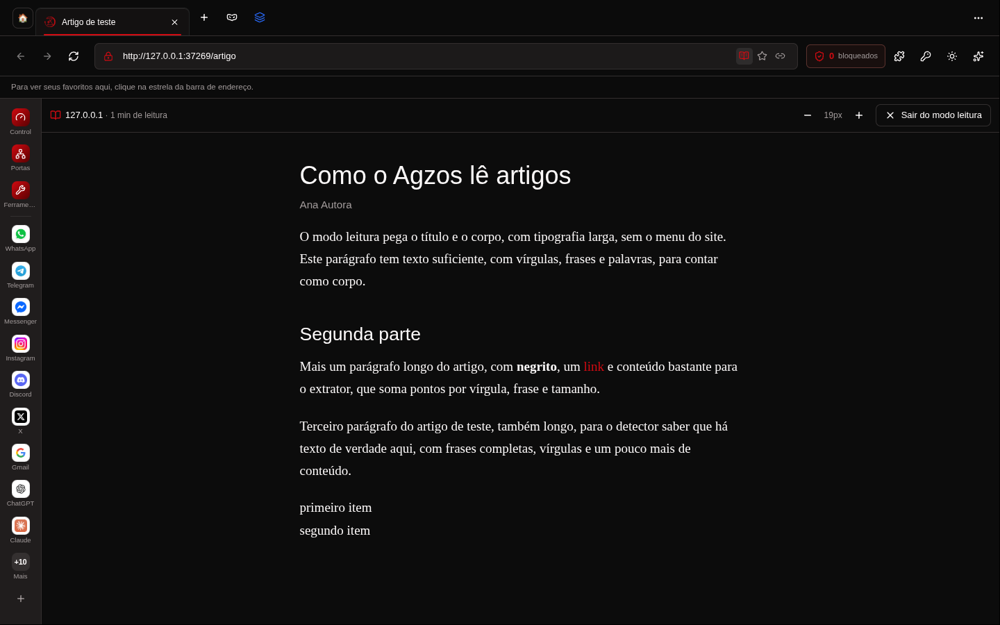      |
|                                     **Barra lateral larga**                                      |                                           **Tema claro**                                           |
| 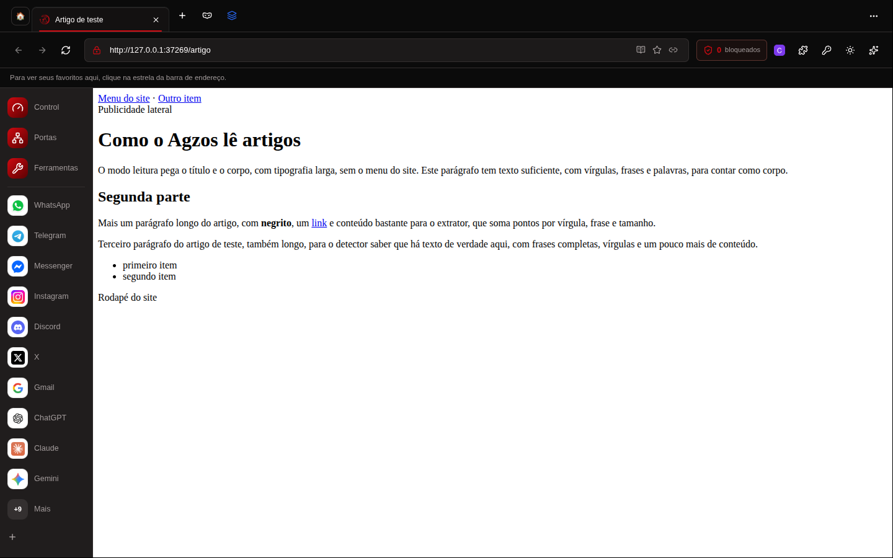  |     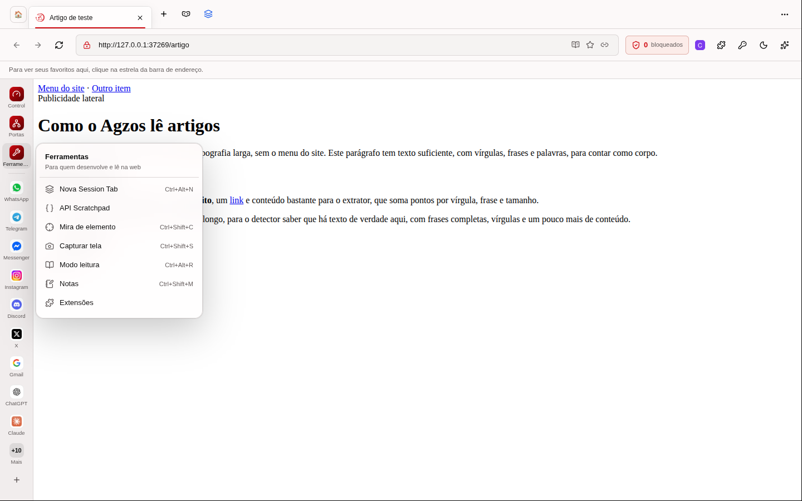      |

Galerias completas: [4.6.1](docs/prints/4.6.1/README.md) · [4.6.0](docs/prints/4.6.0/README.md) · [4.5.1](docs/prints/4.5.1/README.md)

<p align="right"><a href="#topo">↑ topo</a></p>


<a id="instalacao"></a>

## ✦ Instalação

Baixe a versão mais recente em **[agzosagency.com.br/browser](https://agzosagency.com.br/browser/)**:

| Sistema                       | Pacote                                                                 |
| ----------------------------- | ---------------------------------------------------------------------- |
| Windows 10/11 (x64)           | `Agnos-Browser-win32-x64.zip`: descompacte e abra `AgzosBrowser.exe`   |
| macOS (Apple Silicon / Intel) | `.dmg` ou `.app.zip` (`mac-arm64` / `mac-x64`)                         |
| Linux (x64)                   | `Agnos-Browser-linux-x64.tar.gz`: descompacte e rode `./agzos-browser` |

O app procura atualizações sozinho (`latest.json` com SHA-256 de cada pacote). Depois de
atualizar, ele mostra o aviso **"Atualizado com sucesso"** com as novidades da versão.

<p align="right"><a href="#topo">↑ topo</a></p>


<a id="atalhos"></a>

## ✦ Atalhos

| Ação                              | Windows / Linux                          | macOS                |
| --------------------------------- | ---------------------------------------- | -------------------- |
| Nova guia / anônima / Session Tab | `Ctrl+T` / `Ctrl+Shift+N` / `Ctrl+Alt+N` | `⌘T` / `⇧⌘N` / `⌥⌘N` |
| Busca de comandos                 | `Ctrl+K`                                 | `⌘K`                 |
| Agzos AI                          | `Ctrl+Shift+A`                           | `⇧⌘A`                |
| Terminal                          | `Ctrl+Alt+T`                             | `⌥⌘T`                |
| Mira de elemento                  | `Ctrl+Shift+C`                           | `⇧⌘C`                |
| Capturar tela                     | `Ctrl+Shift+S`                           | `⇧⌘S`                |
| Modo leitura                      | `Ctrl+Alt+R`                             | `⌥⌘R`                |
| Notas da página                   | `Ctrl+Shift+M`                           | `⇧⌘M`                |
| Dividir tela                      | `Ctrl+Alt+Shift+S`                       | `⌥⇧⌘S`               |

A lista completa fica em **Configurações → Atalhos de teclado**.

<p align="right"><a href="#topo">↑ topo</a></p>


<a id="desenvolvimento"></a>

## ✦ Desenvolvimento

Requisitos: [Bun](https://bun.sh) e Node 22.

```sh
bun install
bun run dev            # versão web da casca em http://localhost:8080
bun run desktop:build  # bundle do app (dist/) + bibliotecas do main
bun run desktop:start  # abre o app Electron
```

`bun run desktop:dev` abre o Electron apontando para o servidor de desenvolvimento
(`--dev-url=http://localhost:8080`).

<p align="right"><a href="#topo">↑ topo</a></p>


<a id="arquitetura"></a>

## ✦ Arquitetura

```text
electron/            processo principal (main.cjs) e módulos puros testáveis
  main.cjs           janelas, guias (WebContentsView), IPC, sessões e pipeline de rede
  adblock.cjs        motor de filtros (uBlock Origin) e scriptlets
  ai.cjs             Agzos AI (Groq), só no main; chave no safeStorage
  extensions.cjs     extensões MV3, cópia de execução e acesso por site
  ports*.cjs         painel de portas;  tunnel.cjs  túnel cloudflared
  …                  db (SQLite), downloads, PWA, terminal, leitor, captura…
src/
  features/browser/  casca: chrome.tsx, comandos, reducer, persistência (BrowserStore)
  features/*         AI, Key, terminal, extensões, leitura, notas, ferramentas…
  styles.css         tokens do tema (escuro/claro, acento, vidro)
e2e/                 Playwright (web e Electron)
scripts/             build-all.sh (4 plataformas) e release-browser.sh
docs/                PRDs por versão, prints e notas técnicas
```

- O estado do navegador passa só pelo `BrowserStore`: SQLite no app e `localStorage` na web.
- Os painéis da barra (⋯, downloads, extensões, ferramentas) rodam numa camada acima da página, e a página continua viva por baixo.
- Toda ação vem do registro de comandos (`commands.ts`). Os atalhos, o menu de contexto e o menu do Mac usam os mesmos IDs.
- Regras do projeto e decisões por versão: [`AGENTS.md`](AGENTS.md).

<p align="right"><a href="#topo">↑ topo</a></p>


<a id="testes"></a>

## ✦ Testes

```sh
bun run lint && bun run typecheck && bun run test   # lint, tipos e unitários (Vitest)
bun run test:e2e:web                                 # Playwright na versão web
xvfb-run -a bun run test:e2e:desktop                 # Playwright no Electron (sem tela: xvfb-run)
```

Rode todos antes de cada publicação.

<p align="right"><a href="#topo">↑ topo</a></p>


<a id="publicacao"></a>

## ✦ Publicação

```sh
bash scripts/build-all.sh
```

O script gera os pacotes de Windows, Linux e macOS (arm64 e x64) com o Electron da castLabs
(Widevine), assina o app do Mac (ad-hoc) e publica com `scripts/release-browser.sh`. A
publicação atualiza o `latest.json` que o app consulta. Cada versão ganha uma entrada em
`src/features/browser/changelog.ts`.

<p align="right"><a href="#topo">↑ topo</a></p>


<a id="documentacao"></a>

## ✦ Documentação

- [Login do Google no app desktop](docs/login-google-desktop.md): a identidade de Chrome e como testar
- [Roadmap Opera/Vivaldi](docs/roadmap-opera-vivaldi.md): diagnóstico e evolução por fases
- PRDs por versão em [`docs/prd/`](docs/prd/), por exemplo:
  - [4.6: extensões em pop-up, leitura na barra de URL e ferramentas sem repetição](docs/prd/v4.6-extensoes-popup-leitura-barra.md)
  - [4.6.1: Chrome Web Store, pop-up que não encolhe e clique pelo manifest](docs/prd/v4.6.1-web-store-popup-manifest.md)
  - [4.5: Session Tabs, portas e túnel, Scratchpad, extensões, Widevine e leitura](docs/prd/v4.5-dev-sessoes-extensoes-leitura.md)
  - [4.1.3: PWA instalável e Agzos AI no estilo do Claude](docs/prd/v4.1.3-pwa-e-agzos-ai-estilo-claude.md)
  - [4.0: IA, gestos, terminal e GPU](docs/prd/v4.0-ia-gestos-terminal-gpu.md)

<p align="center">
  <br>
  <sub>Agzos Browser · feito pela Agzos</sub><br>
  <a href="#topo">↑ voltar ao topo</a>
</p>
