# Agzos Browser 4.5.1 — prints

Tirados do app de verdade (Linux, Xvfb, 1440×900), com as páginas e menus nativos.

## Página inicial e Discador com Ferramentas

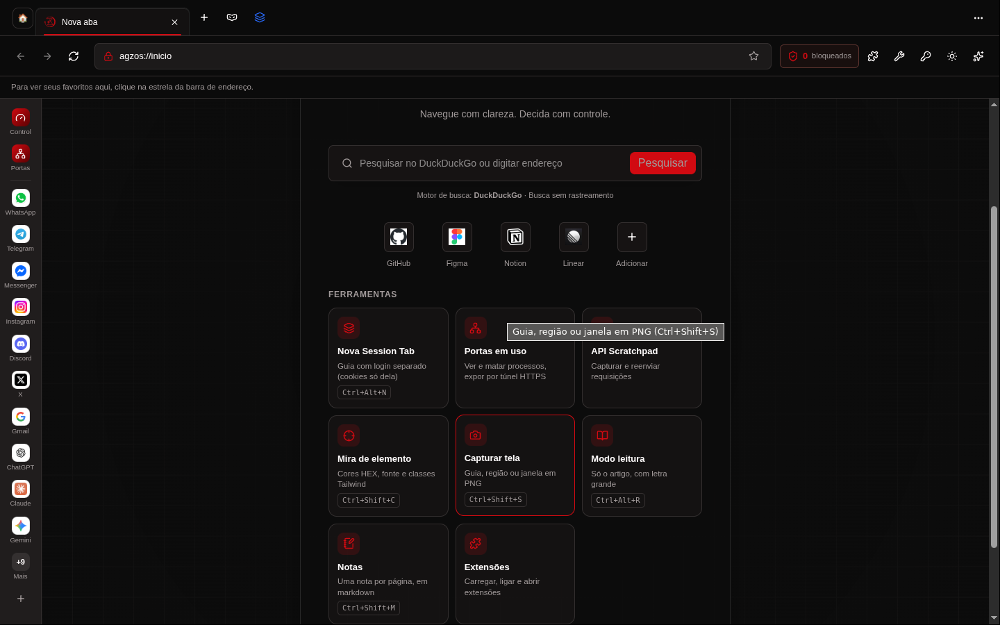
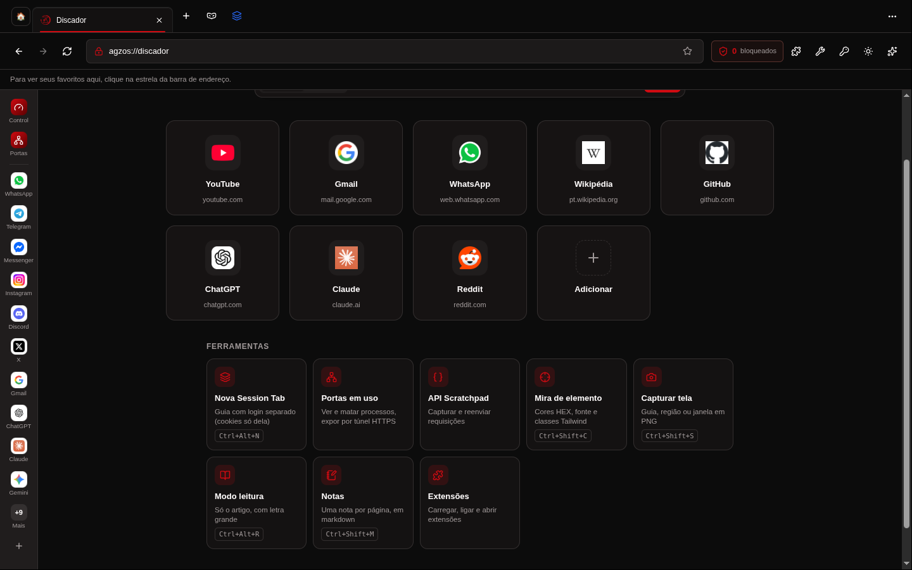

## Session Tabs (botão ao lado da guia anônima, uma cor por sessão)

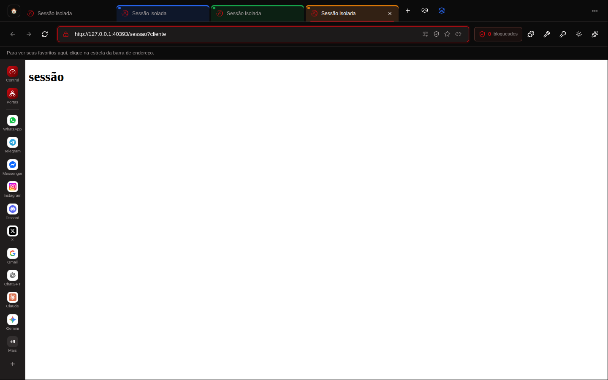

## Botão Ferramentas da barra

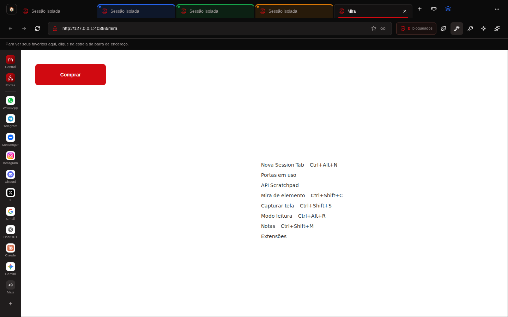

## Mira de elemento (Ctrl+Shift+C)

## Portas em uso e túnel HTTPS

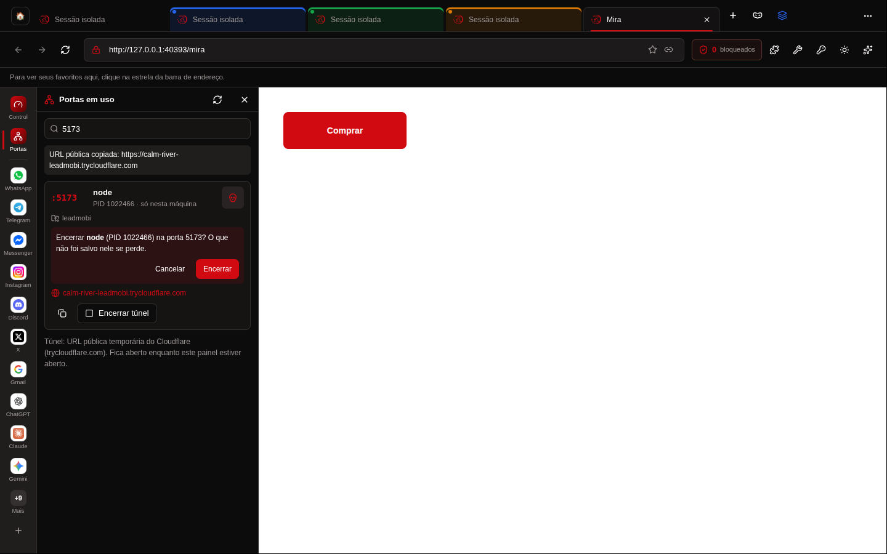

## Painel lateral: “Tela toda” e “Recolher”

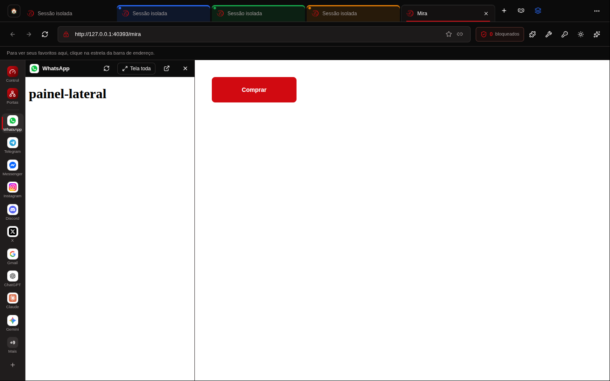
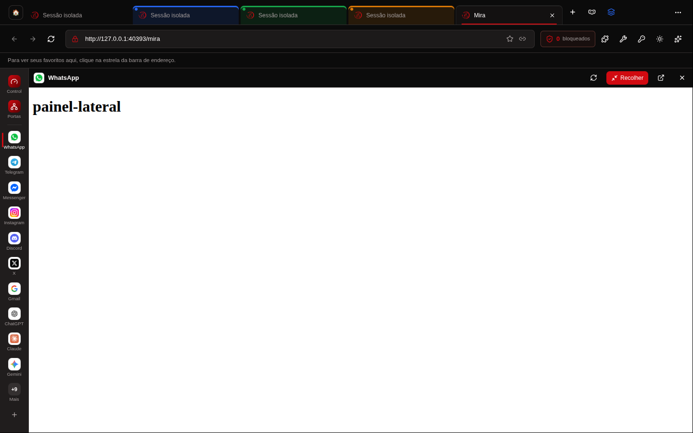

## Extensões (botão da barra e Configurações)

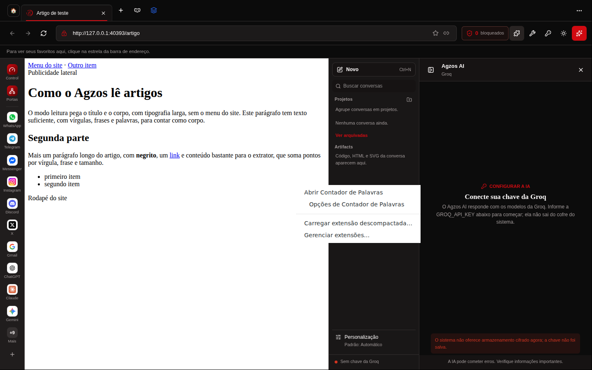
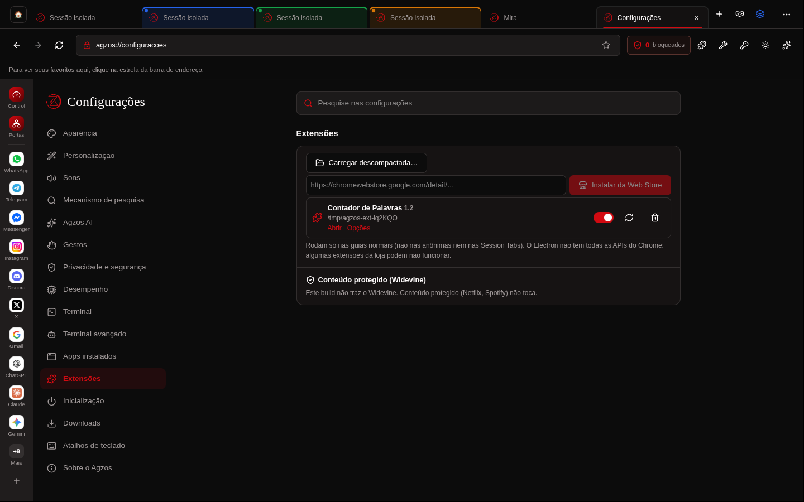

## API Scratchpad

## Modo leitura, Notas e Captura

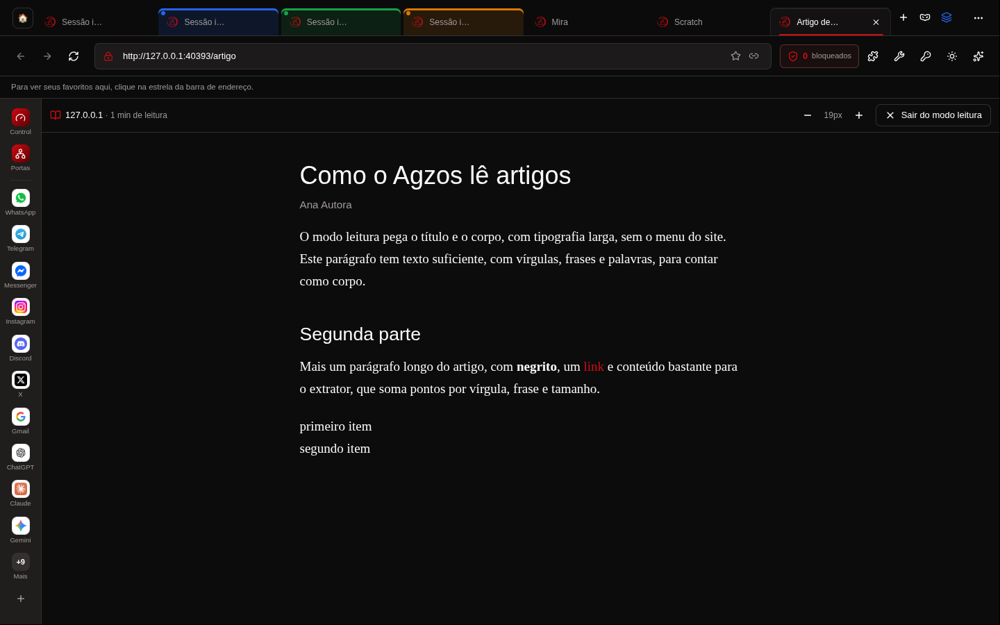
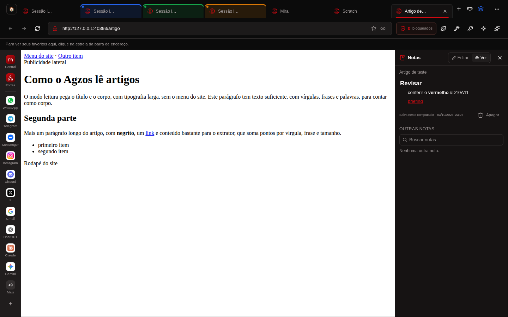
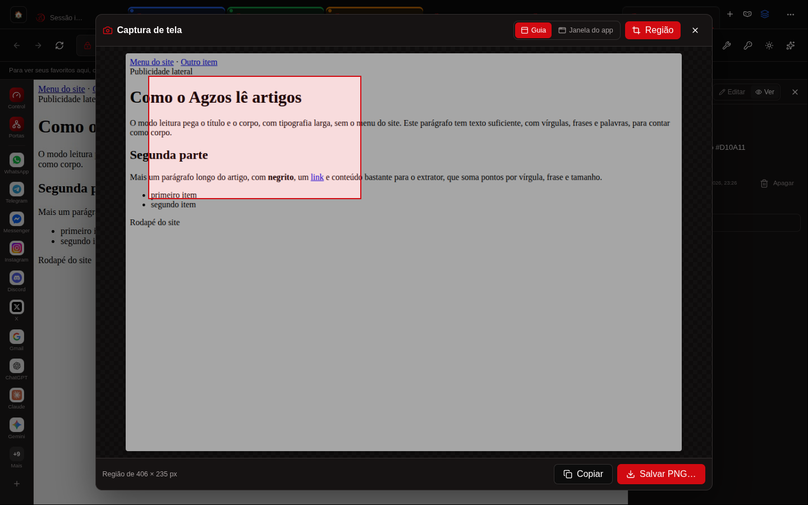

## Tema claro

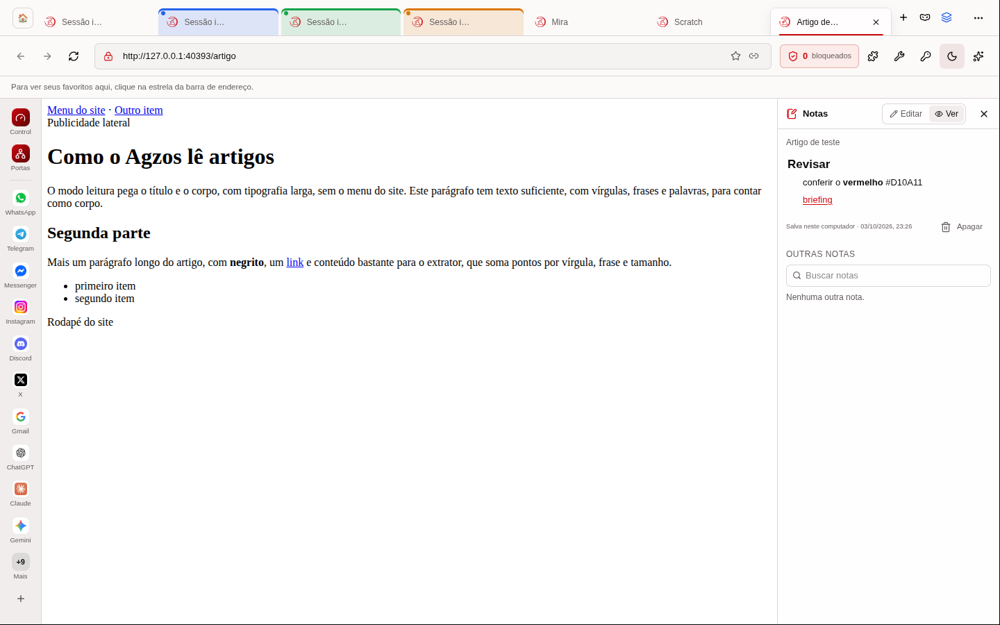
