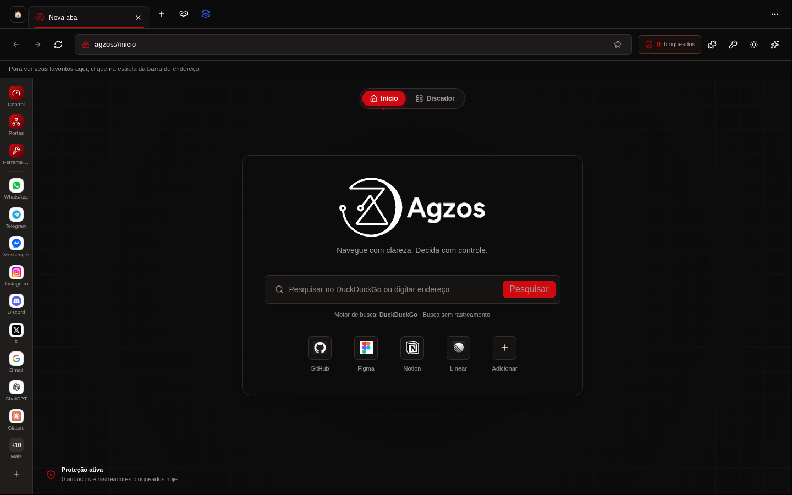
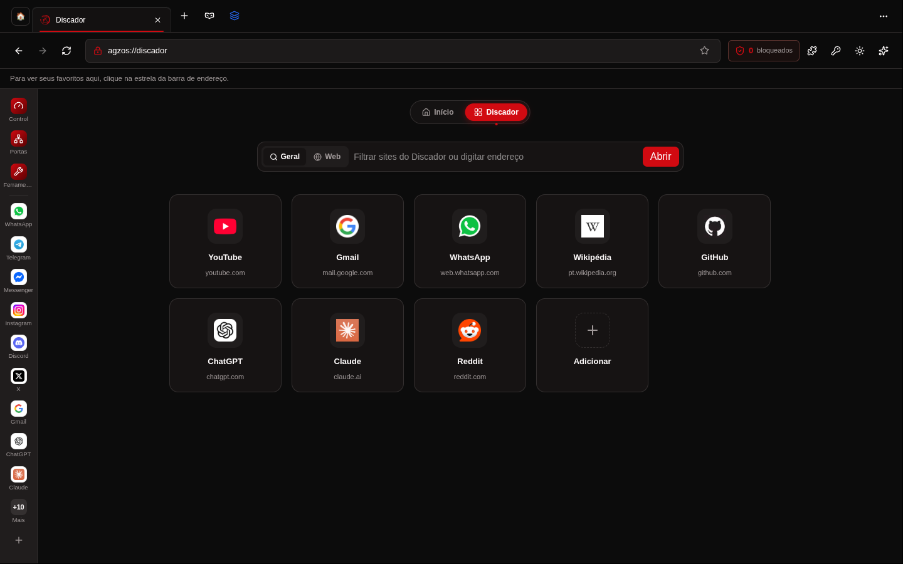
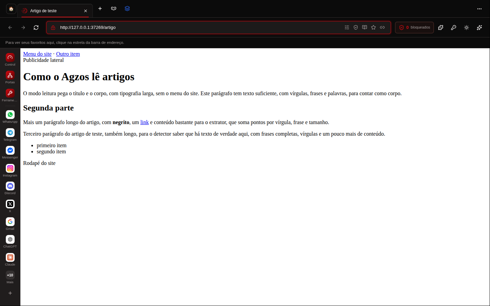
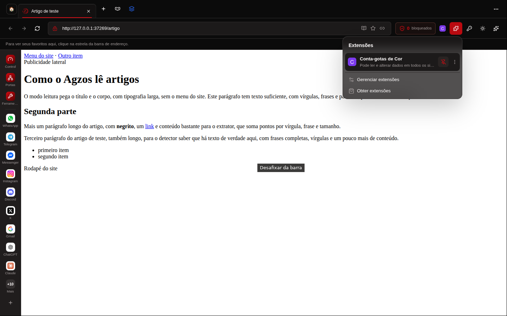
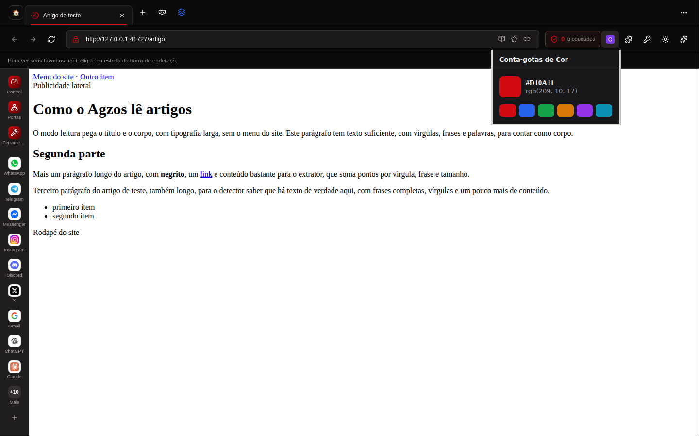
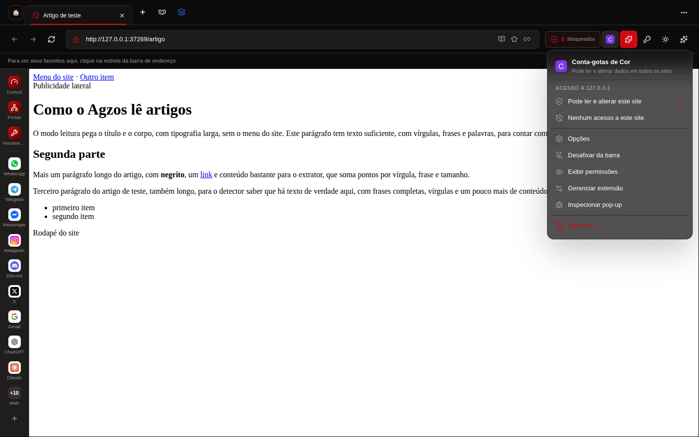
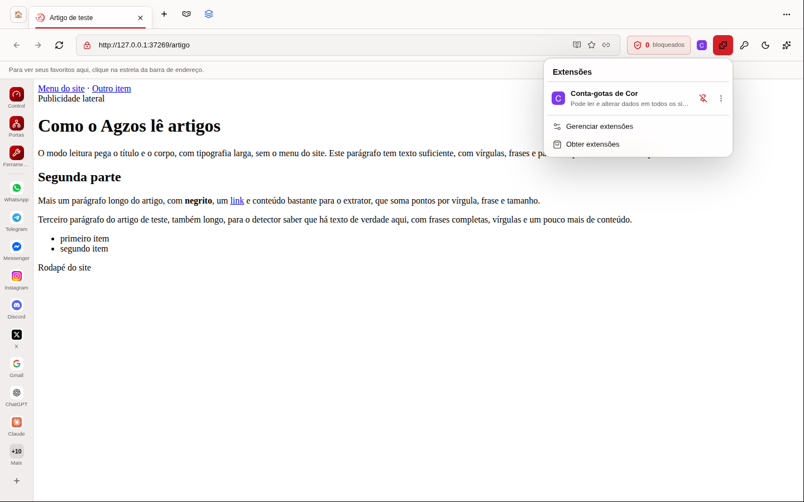
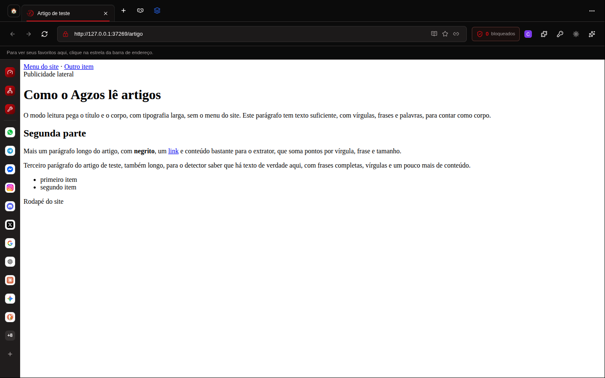

# Agzos Browser 4.6.0 — prints

Tirados do app de verdade (Linux, Xvfb, 1440×900), com páginas, camada dos painéis e o pop-up da extensão.

## Página inicial e Discador sem ferramentas repetidas

## Ferramentas na barra lateral (vidro, tema escuro e claro)

## Caderno do modo leitura na barra de URL

## Extensões

## Barra lateral redimensionável

