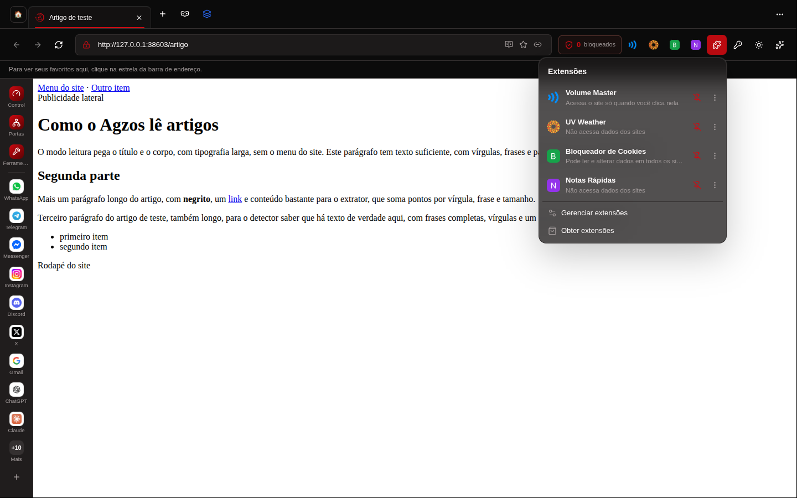
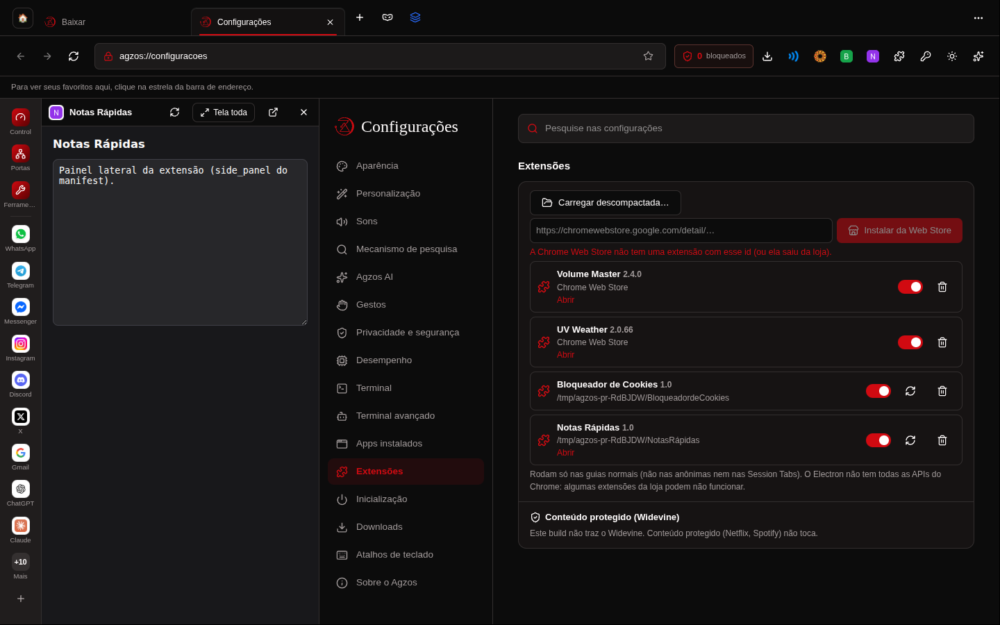
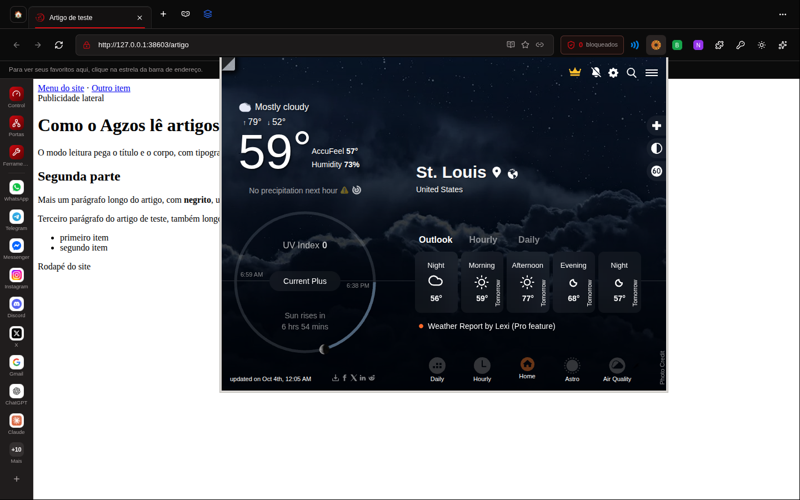
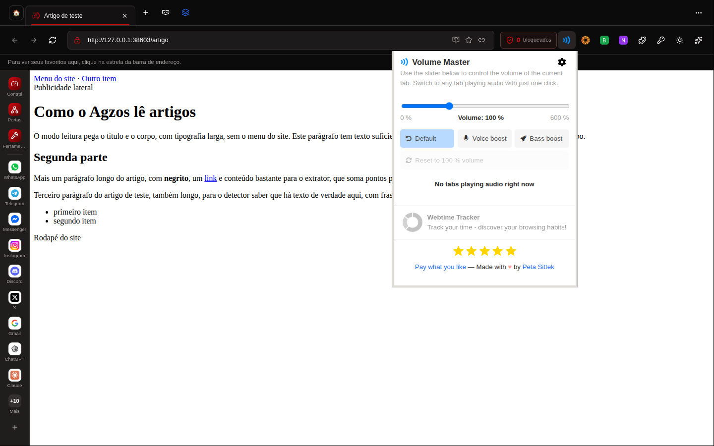
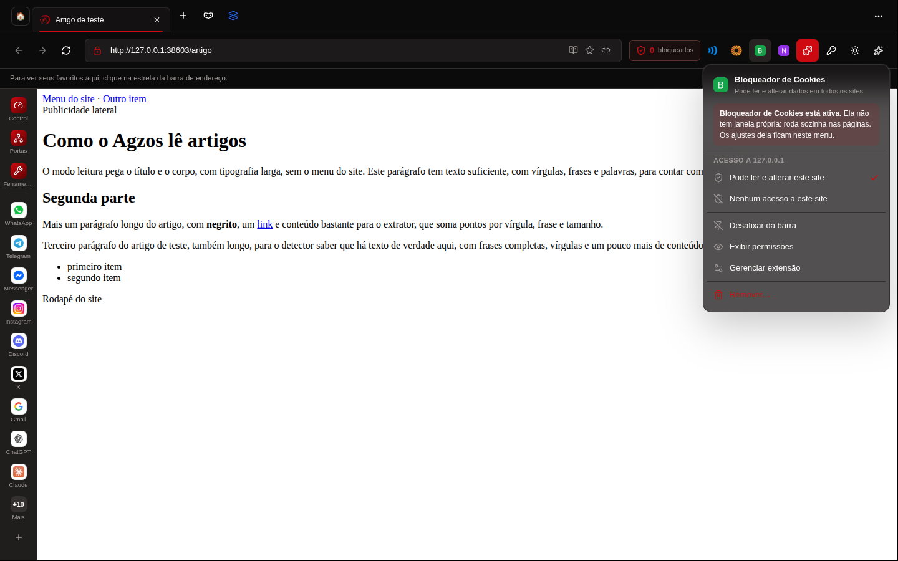
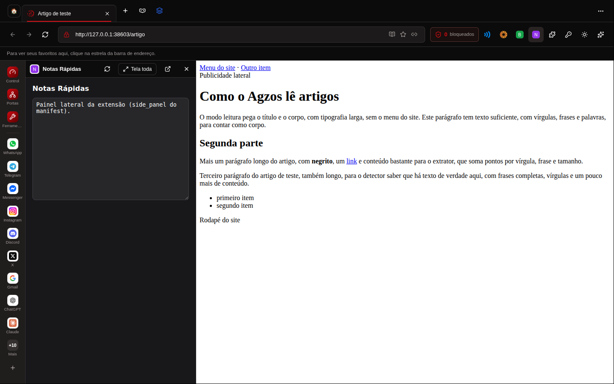
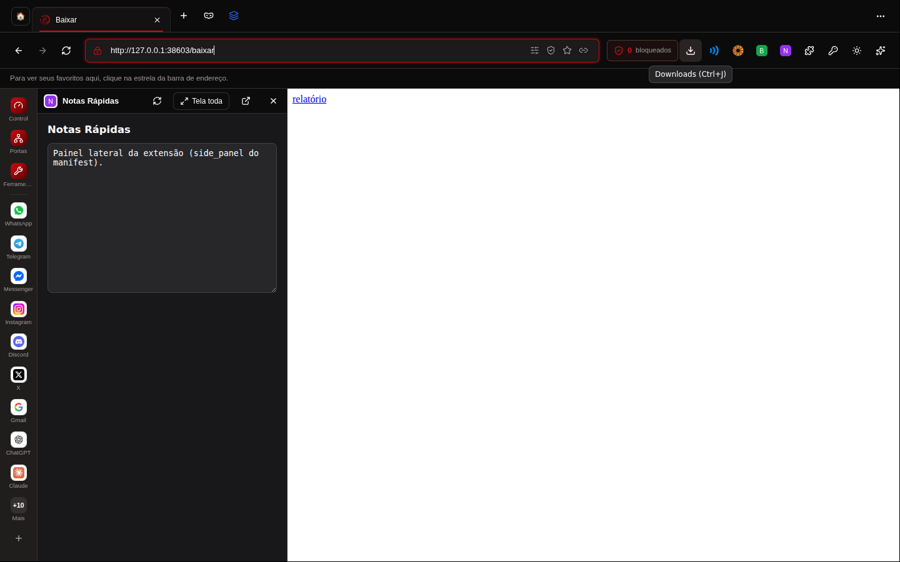

# Agzos Browser 4.6.1 — prints

Tirados do app de verdade (Linux, Xvfb, 1440×900). Volume Master e UV Weather foram
instaladas pelo link da Chrome Web Store, baixadas da loja na hora.

## Instalar da Chrome Web Store

As duas extensões da loja com o id da loja (`jghecgabfgfdldnmbfkhmffcabddioke` e
`ngeokhpbgoadbpdpnplcminbjhdecjeb`), ao lado de duas descompactadas.

Id que a loja não tem: erro de verdade, nada instalado.

## Pop-up que não encolhe

Volume Master, depois UV Weather (pop-up grande, 800×600), depois Volume Master de novo
no tamanho dele (367×473), sem faixa pequena.

## O manifest decide o clique

Extensão só de fundo (sem pop-up, painel ou opções): o clique mostra que ela está ativa
no menu dela, sem abrir janela vazia. O menu só traz o que existe.

Extensão com `side_panel`: abre no painel lateral do navegador.

## Dica da barra inteira

