# Agzos Browser 4.7.0: prints

Tirados do app de verdade (Linux, Xvfb, 1440×900). A Wikipédia é a página real; os
downloads, a paleta de cores e o contrato em PDF vêm de um servidor local do teste.

## Gerenciador de downloads (Ctrl+J)

Pastas por tipo ligadas e duas regras: o site do teste ganha a etiqueta "Trabalho" e os
nomes `NF-…` ganham "Fiscal" e a subpasta Notas.

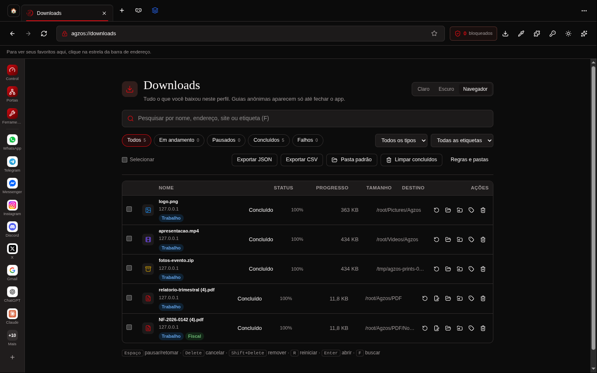
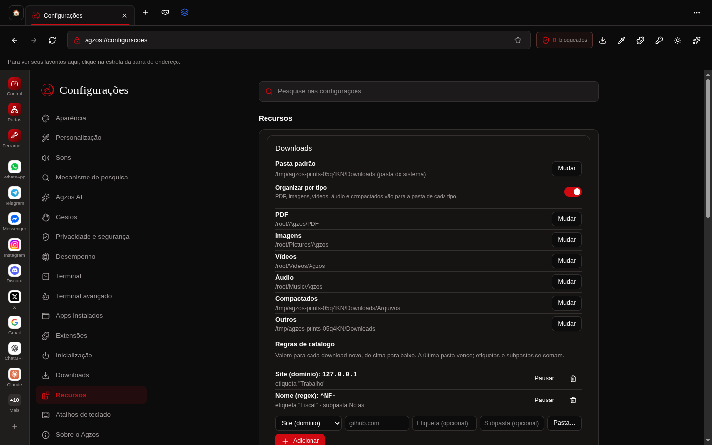

## Tema por site

A mesma página antes e depois da lua na barra de endereço. A página fica escura, e as
fotos e o mapa continuam como são.

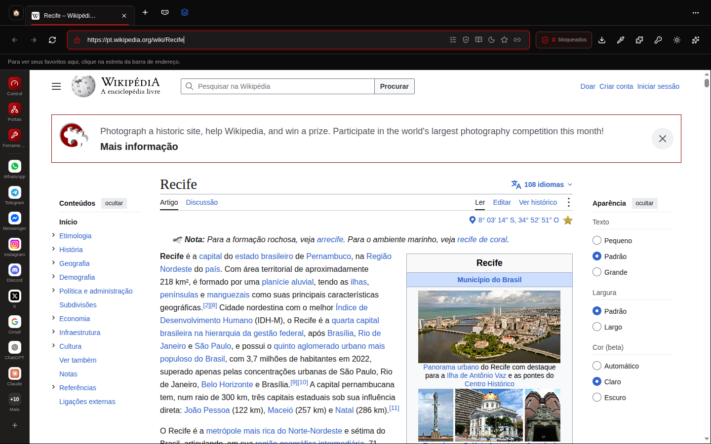
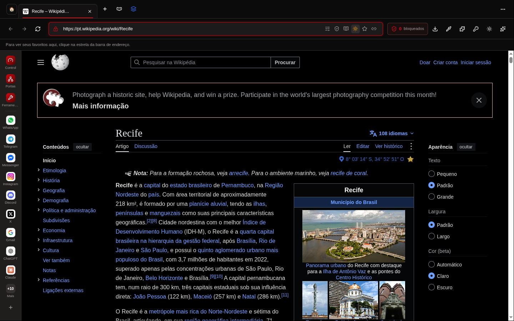

## ColorTools

Conta-gotas com lupa e HEX/RGB/HSL ao vivo; a cor escolhida no painel (já copiada); as
cores da página pelo analisador; o gerador de gradiente.

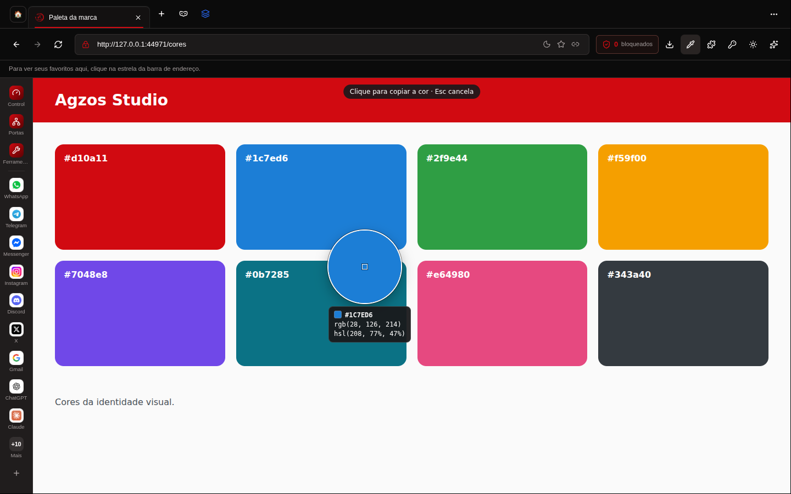
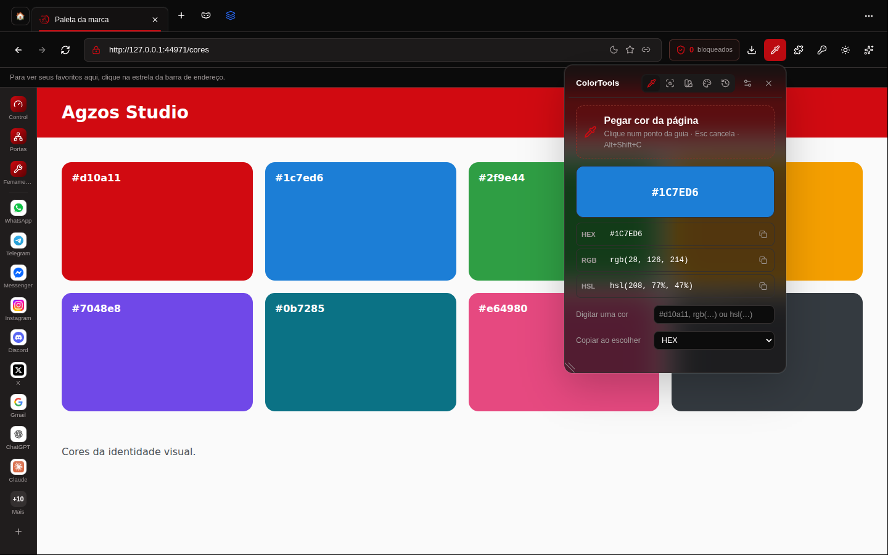
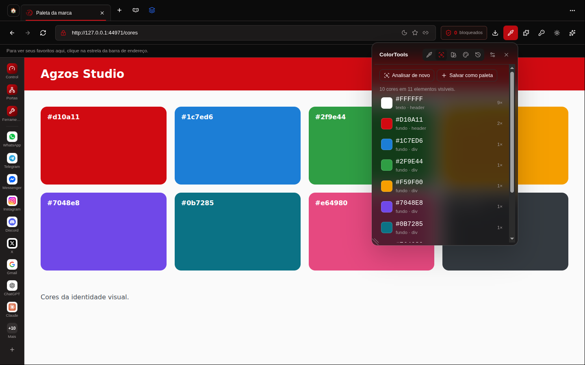
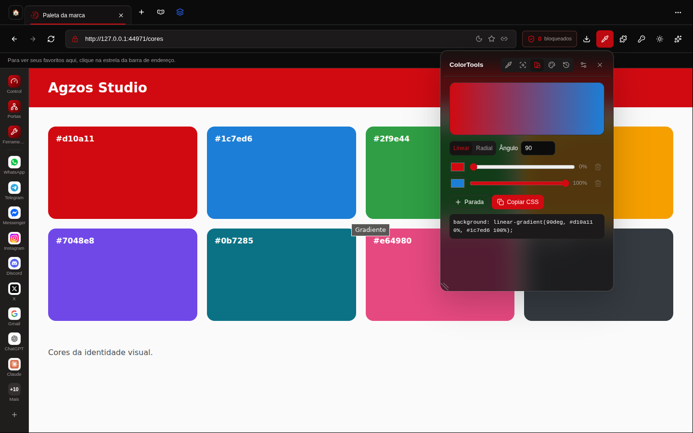

## PDF Tools

O PDF abre na guia, e o ícone PDF na barra de endereço o leva ao PDF Tools.

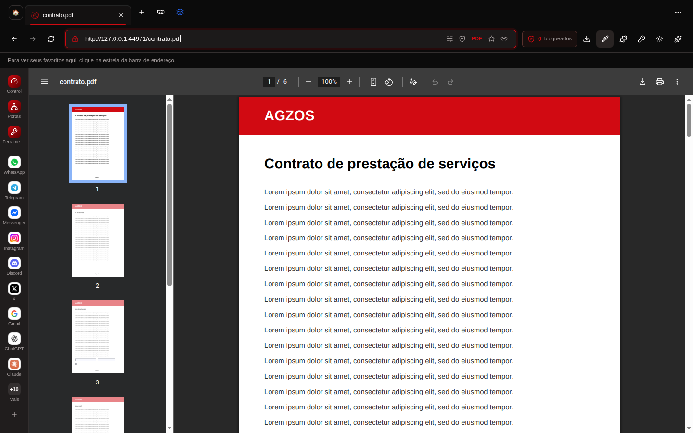
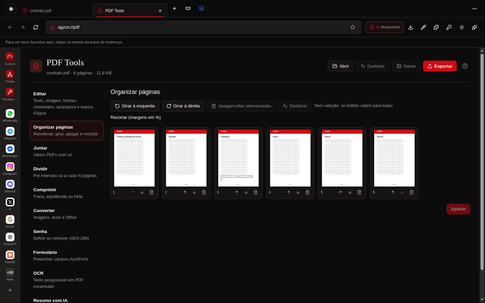

Editor: texto, marca-texto e assinatura desenhada, aplicados no PDF.

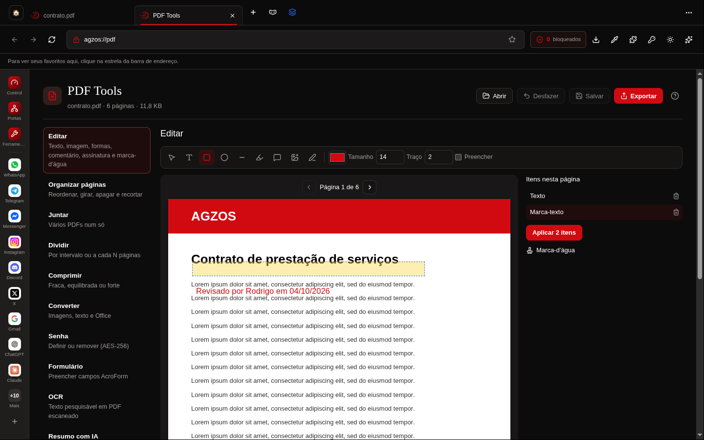
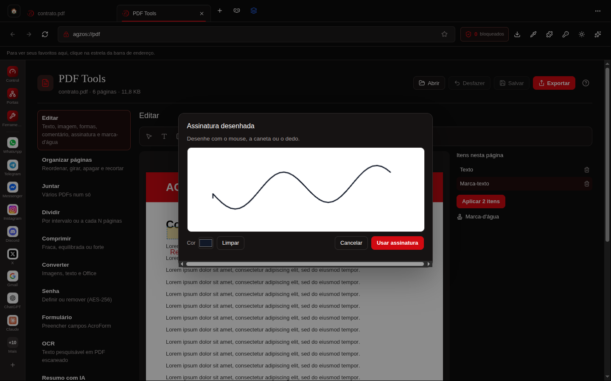
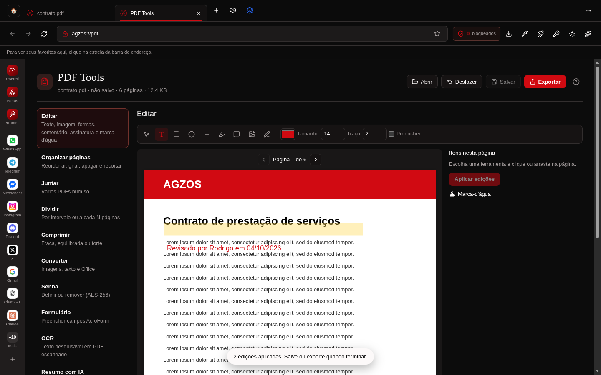
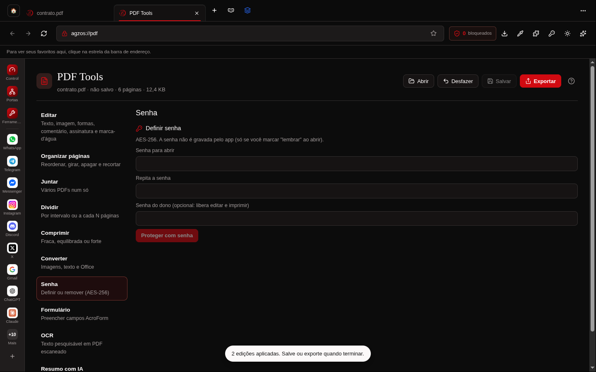

OCR local (português e inglês) da página 1, com o texto que o editor acrescentou.

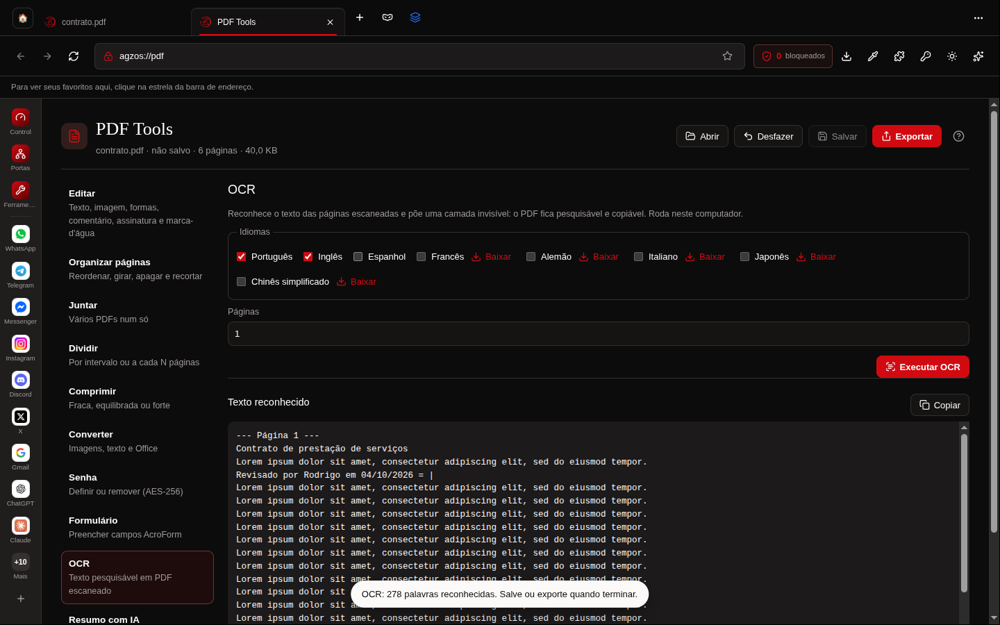
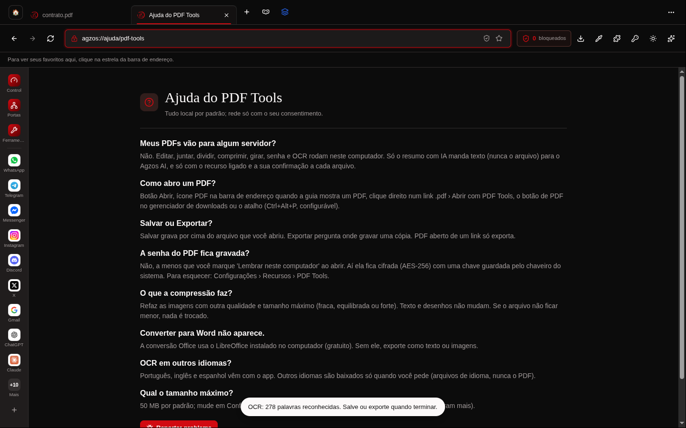
